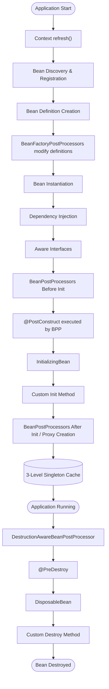

# The Complete Spring Bean Lifecycle: What Really Happens Before Your Application Starts

Most Spring Boot developers write code like this:

```java
@Service
public class UserService {

}
```

or

```java
@RestController
public class UserController {

    private final UserService userService;

    public UserController(UserService userService) {
        this.userService = userService;
    }
}
```

The application starts.

Everything works.

And most developers never think about what Spring is actually doing behind the scenes.

But before your application serves a single request, Spring performs dozens of operations:

- Scans packages
- Creates bean definitions
- Instantiates objects
- Injects dependencies
- Executes lifecycle callbacks
- Creates AOP proxies
- Initializes singleton beans

In this article, we'll follow a Spring bean through its entire lifecycle.

---

## The Bean We'll Track

Let's use this bean:

```java
@Component
public class UserService {

    public UserService() {
        System.out.println("Constructor");
    }

    @PostConstruct
    public void init() {
        System.out.println("PostConstruct");
    }

    @PreDestroy
    public void destroy() {
        System.out.println("PreDestroy");
    }
}
```

We'll see exactly how Spring creates and manages it.

---

## Step 1: Application Starts

Execution begins:

```java
@SpringBootApplication
public class App {

    public static void main(String[] args) {
        SpringApplication.run(App.class, args);
    }
}
```

Spring Boot creates:

`ApplicationContext`

Think of it as:

```text
Super Container
    |
    +-- BeanFactory
    +-- Environment
    +-- Event System
    +-- Resource Management
```

The `ApplicationContext` is responsible for managing all beans.

However, the real orchestrator of the entire lifecycle is the `refresh()` method inside `AbstractApplicationContext`. When your application starts, Spring executes:

1.  `prepareRefresh()`
2.  `obtainFreshBeanFactory()`
3.  `invokeBeanFactoryPostProcessors()`
4.  `registerBeanPostProcessors()`
5.  `finishBeanFactoryInitialization()` (This is where singleton beans are actually created)
6.  `finishRefresh()`

Let's break these phases down.

---

## Step 2: Bean Discovery & Registration

Spring discovers bean definitions through various mechanisms—not just component scanning.

While `@ComponentScan` finds your `@Component`, `@Service`, and `@RestController` classes, Spring also registers beans via:

- `@Bean` methods inside `@Configuration` classes
- `@Import` annotations
- `ImportSelector` and `AutoConfiguration`
- `FactoryBean` implementations

Every discovered bean is registered.

At this point Spring DOES NOT create objects.

It only creates metadata.

---

## Step 3: Bean Definition Creation

Spring creates a BeanDefinition.

Think of it as a blueprint.

Example:

```properties
Bean Name: userService
Class: UserService.class
Scope: Singleton
Lazy: false
DependsOn: [emailService]
Primary: true
InitMethodName: init
FactoryMethodName: createUserService
```

A `BeanDefinition` is a rich metadata object, far more complex than just a name and a class.

No object exists yet.

Only instructions for creating one.

---

## Step 4: BeanFactory Stores Definitions

Internally:

```text
BeanDefinitionMap
```

contains:

```text
userService -> BeanDefinition
orderService -> BeanDefinition
userController -> BeanDefinition
```

Spring now knows what must be created.

---

## Step 4.5: BeanFactoryPostProcessors

Before Spring instantiates any beans, it executes `BeanFactoryPostProcessors` (BFPPs).

This is a crucial phase where Spring allows the modification of `BeanDefinition` metadata.

Examples of BFPPs in action:

- `PropertySourcesPlaceholderConfigurer`: Replaces `@Value("${api.key}")` placeholders with actual values from `application.properties`.
- `ConfigurationClassPostProcessor`: Parses `@Configuration` classes to find `@Bean` methods.

BFPPs modify the _recipes_ (BeanDefinitions) before the _cakes_ (Beans) are baked.

---

## Interlude: FactoryBean vs BeanFactory

It's important to clarify a common source of confusion:

- `BeanFactory`: The core Spring container that holds and manages all beans (as seen above).
- `FactoryBean<T>`: An interface you can implement to create complex beans where standard `@Bean` or `@Component` instantiation isn't enough. Many Spring internals (like JPA `EntityManagerFactory` creation or Proxy creation) rely on `FactoryBean`s.

Here is a quick example of a `FactoryBean`:

```java
@Component
public class CustomConnectionFactoryBean implements FactoryBean<Connection> {

    @Override
    public Connection getObject() throws Exception {
        // Complex custom logic to create the connection
        return DriverManager.getConnection("jdbc:...");
    }

    @Override
    public Class<?> getObjectType() {
        return Connection.class;
    }
}
```

When Spring sees this, it doesn't register `CustomConnectionFactoryBean` as the primary bean type. Instead, it calls `getObject()` and registers the returned `Connection` object as the bean.

---

## Step 5: Bean Instantiation

Spring begins creating singleton beans (inside the `finishBeanFactoryInitialization()` phase).

It calls:

```java
new UserService()
```

Output:

```text
Constructor
```

At this moment:

```text
Object Exists
Dependencies Not Injected Yet
```

Many developers incorrectly assume the bean is fully initialized here.

It isn't.

---

## Step 6: Dependency Injection

If we use constructor injection (which is the modern Spring best practice):

```java
@Service
public class UserService {

    private final EmailService emailService;

    public UserService(EmailService emailService) {
        this.emailService = emailService;
    }
}
```

Spring resolves `EmailService` from the container and injects it during instantiation.

Conceptually:

```java
EmailService emailService = beanFactory.getBean(EmailService.class);
UserService userService = new UserService(emailService);
```

_(Note: Dependency Injection can happen via **Constructor Injection**, **Setter Injection**, or **Field Injection**. With Constructor Injection, instantiation and injection happen simultaneously. With Setter/Field injection, the bean is instantiated via a no-args constructor first, and dependencies are injected afterward via reflection. Constructor injection is preferred.)_

Now dependencies are available.

---

## Step 7: Aware Interfaces

If the bean implements interfaces like `BeanNameAware`, `BeanFactoryAware`, or `ApplicationContextAware`, Spring invokes them to give the bean access to internal framework components.

However, there is a subtle timing difference:

- `BeanNameAware` and `BeanFactoryAware` are called **natively** right now.
- `ApplicationContextAware` is actually invoked slightly later, handled by a `BeanPostProcessor`.

Example:

```java
@Override
public void setBeanName(String name) {
    System.out.println(name);
}
```

Output:

```text
userService
```

This gives beans access to Spring internals if they need it.

---

## Step 8: BeanPostProcessor Before Initialization

Now Spring executes:

```java
postProcessBeforeInitialization()
```

for every registered `BeanPostProcessor`.

This is one of Spring's most powerful extension points. Many of Spring's "magical" features are implemented using BPPs during this exact phase:

- `AutowiredAnnotationBeanPostProcessor` handles `@Autowired` and `@Value`.
- `ConfigurationPropertiesBindingPostProcessor` handles `@ConfigurationProperties`.
- `CommonAnnotationBeanPostProcessor` executes `@PostConstruct` (our next step!).

---

## Step 9: @PostConstruct

Triggered by the aforementioned `BeanPostProcessor`, Spring executes:

```java
@PostConstruct
public void init()
```

Output:

```text
PostConstruct
```

This is where:

- Cache loading
- Connection initialization
- Startup validation

usually occurs.

The bean is now initialized.

---

## Step 10: InitializingBean

If implemented:

```java
public class UserService
implements InitializingBean
```

Spring executes:

```java
afterPropertiesSet()
```

after dependency injection.

Example:

```java
@Override
public void afterPropertiesSet() {
    System.out.println("InitializingBean");
}
```

---

## Step 11: Custom Init Method

Spring can also call:

```java
@Bean(initMethod = "initialize")
```

Example:

```java
public void initialize() {
    System.out.println("Custom Init");
}
```

Now multiple initialization mechanisms have executed.

---

## Step 12: BeanPostProcessor After Initialization (Proxy Creation)

Now Spring executes:

```java
postProcessAfterInitialization()
```

This stage is extremely important. Framework features like **Transactions**, **Security**, and **AOP** heavily rely on this phase.

Instead of returning the original bean, Spring often creates and returns a **Proxy Object**.

Consider:

```java
@Transactional
public void saveUser() {}
```

Spring replaces `UserService` with `Proxy(UserService)`. When you call `saveUser()`, the proxy intercepts the call, opens a transaction, executes the actual method, and then commits the transaction.

### Proxy Types

Spring uses two main types of proxies here:

1.  **JDK Dynamic Proxies**: Used if the bean implements at least one interface.
2.  **CGLIB Proxies**: Used if the bean does not implement any interfaces (Spring creates a subclass of your bean).

You are often interacting with these proxies rather than your actual beans!

---

## Step 13: The 3-Level Singleton Cache

The fully initialized bean (or its proxy) is placed into Spring's Singleton Cache.

However, Spring actually maintains a **3-Level Cache** internally to manage singletons:

1.  `singletonObjects` (1st Level Cache): Fully initialized, ready-to-use beans.
2.  `earlySingletonObjects` (2nd Level Cache): Partially initialized beans (instantiated, but dependencies not yet injected).
3.  `singletonFactories` (3rd Level Cache): Object factories that can create an early reference to a bean.

###### Why 3 Levels? Circular Dependencies!

A senior engineer expects you to know _why_ this complexity exists. It exists to resolve **Circular Dependencies**.

Imagine `ServiceA` requires `ServiceB`, and `ServiceB` requires `ServiceA`.

```java
@Service
public class ServiceA {
    @Autowired
    private ServiceB serviceB; // Note: Works with field/setter injection
}

@Service
public class ServiceB {
    @Autowired
    private ServiceA serviceA;
}
```

1. Spring instantiates `ServiceA`. It places an early reference factory for `ServiceA` in the 3rd level cache (`singletonFactories`).
2. Spring tries to inject `ServiceB` into `ServiceA`. It must create `ServiceB`.
3. Spring instantiates `ServiceB`. It tries to inject `ServiceA` into `ServiceB`.
4. Spring looks in the 1st and 2nd level caches for `ServiceA`—not there. It looks in the 3rd level cache, finds the factory, creates an early reference of `ServiceA`, and promotes it to the 2nd level cache (`earlySingletonObjects`).
5. `ServiceB` is fully initialized with the early reference of `ServiceA` and placed in the 1st level cache.
6. `ServiceA` finishes initializing with the fully baked `ServiceB` and is placed in the 1st level cache.

_(Note: Constructor injection cannot resolve circular dependencies natively without `@Lazy`, because you cannot instantiate the class to create an early reference without its constructor arguments!)_

---

## Step 14: Application Ready

Now:

```java
@Autowired
private UserService userService;
```

works.

The bean is ready to serve requests.

---

## What Happens During Shutdown?

When the application stops:

`SIGTERM`

or

`Context Close`

Spring begins bean destruction.

---

## Step 15: DestructionAwareBeanPostProcessor & @PreDestroy

Before a bean is destroyed, Spring gives `DestructionAwareBeanPostProcessors` a chance to execute.

This is the exact mechanism that triggers `@PreDestroy` methods.

Spring executes:

```java
@PreDestroy
public void destroy()
```

Output:

```text
PreDestroy
```

Typical use cases:

- Closing connections
- Flushing caches
- Releasing resources

---

## Step 16: DisposableBean

If implemented:

```java
destroy()
```

is called.

---

## Step 17: Custom Destroy Method

Example:

```java
@Bean(destroyMethod = "cleanup")
```

Spring executes:

```java
cleanup()
```

before bean removal.

---

## Full Lifecycle Summary



## Key Takeaway

A Spring bean is far more than a Java object created with `new`.

Between application startup and shutdown, Spring performs scanning, dependency injection, lifecycle callbacks, proxy creation, transaction wiring, and resource management.

Understanding the bean lifecycle makes it much easier to debug startup issues, circular dependencies, proxy behavior, and production problems involving Spring applications.

---

## References

- **[Spring Framework Source Code (GitHub)](https://github.com/spring-projects/spring-framework)**
- [`AbstractApplicationContext` JavaDoc](https://docs.spring.io/spring-framework/docs/current/javadoc-api/org/springframework/context/support/AbstractApplicationContext.html)
- [`DefaultListableBeanFactory` JavaDoc](https://docs.spring.io/spring-framework/docs/current/javadoc-api/org/springframework/beans/factory/support/DefaultListableBeanFactory.html)
- [`AbstractAutowireCapableBeanFactory` JavaDoc](https://docs.spring.io/spring-framework/docs/current/javadoc-api/org/springframework/beans/factory/support/AbstractAutowireCapableBeanFactory.html)
- [`BeanPostProcessor` JavaDoc](https://docs.spring.io/spring-framework/docs/current/javadoc-api/org/springframework/beans/factory/config/BeanPostProcessor.html)
- [`FactoryBean` JavaDoc](https://docs.spring.io/spring-framework/docs/current/javadoc-api/org/springframework/beans/factory/FactoryBean.html)
